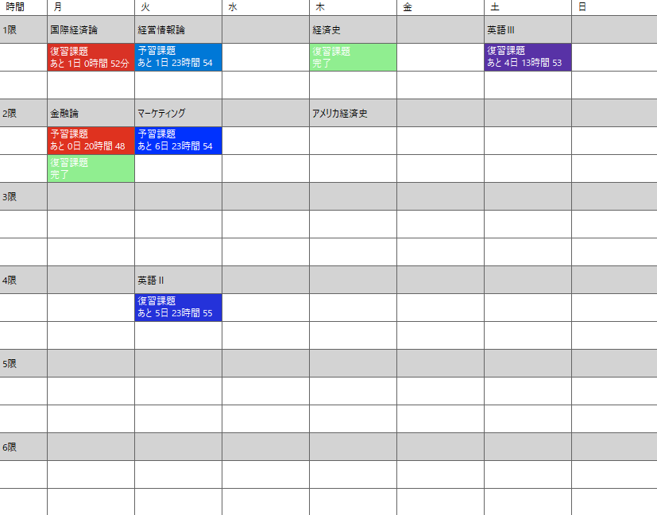

# HomeworkApp

大学の課題管理を目的として作成した C# WinForms アプリです。

ChatGPTを活用しながら設計・実装を行いました。

コードの意味を理解しながら製作したため、コードのいたる部分に解説用のコメントをつけています。

課題提出までの残り時間を色で表現することで、提出状況を直感的に確認できるようにしました。

## 機能

- 授業ごとの課題登録
- 締切までの残り時間表示
- 締切までの時間に応じたセル色の変化
- 課題完了管理
- CSVによるデータ保存・読み込み

## 使用技術

- C#
- WinForms
- Visual Studio 2022

## 制作背景

大学の課題管理を効率化するために個人開発しました。

授業ごとの課題と締切を管理し、提出忘れを防ぐことを目的としています。残り時間を色で表現することで、提出期限の近い課題を素早く把握できるよう工夫しました。

## 工夫した点

- 締切までの残り時間に応じてセルの色が変化する機能を実装
- 課題完了時には状態を記録し、次回締切時に自動でリセットされる仕組みを実装
- CSVファイルを用いたデータ保存・読み込み機能を実装

- ## アプリ画面

※授業・課題内容は架空のものです。
